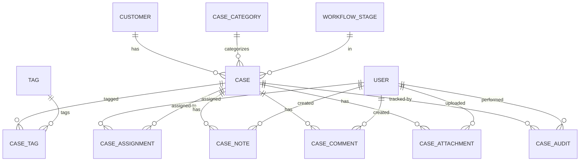

# Entity Model

## Entity Relationship Diagram

## Entity Definitions

### CUSTOMER

Represents individuals or organizations that receive services and have associated cases.

| Attribute        | Description                                    | Data Type | Length/Precision | Validation Rules                      |
|------------------|------------------------------------------------|-----------|------------------|---------------------------------------|
| id               | Unique identifier                              | Long      | 19               | Primary Key, Sequence                 |
| customer_type    | Type of customer (INDIVIDUAL or ORGANIZATION)  | String    | 20               | Not Null, Values: INDIVIDUAL, ORGANIZATION |
| first_name       | First name for individuals                     | String    | 100              | Optional                              |
| last_name        | Last name for individuals                      | String    | 100              | Optional                              |
| organization_name| Name for organizations                         | String    | 200              | Optional                              |
| email            | Primary email address                          | String    | 255              | Not Null, Format: Email, Unique       |
| phone            | Primary phone number                           | String    | 50               | Optional                              |
| address          | Street address                                 | String    | 255              | Optional                              |
| city             | City name                                      | String    | 100              | Optional                              |
| state            | State or province                              | String    | 100              | Optional                              |
| postal_code      | Postal or ZIP code                             | String    | 20               | Optional                              |
| country          | Country name                                   | String    | 100              | Optional                              |
| created_at       | Timestamp when customer was created            | DateTime  | -                | Not Null                              |
| updated_at       | Timestamp when customer was last updated       | DateTime  | -                | Not Null                              |

**Constraints:** For INDIVIDUAL type, first_name and last_name are required. For ORGANIZATION type, organization_name is required.

### USER

Represents system users who can create, manage, and be assigned to cases.

| Attribute      | Description                                  | Data Type | Length/Precision | Validation Rules          |
|----------------|----------------------------------------------|-----------|------------------|---------------------------|
| id             | Unique identifier                            | Long      | 19               | Primary Key, Sequence     |
| username       | Unique username for authentication           | String    | 50               | Not Null, Unique          |
| password_hash  | BCrypt hashed password                       | String    | 255              | Not Null                  |
| first_name     | User's first name                            | String    | 100              | Not Null                  |
| last_name      | User's last name                             | String    | 100              | Not Null                  |
| email          | User's email address                         | String    | 255              | Not Null, Format: Email, Unique |
| active         | Whether the user account is active           | Boolean   | 1                | Not Null                  |
| created_at     | Timestamp when user was created              | DateTime  | -                | Not Null                  |
| updated_at     | Timestamp when user was last updated         | DateTime  | -                | Not Null                  |

### CASE_CATEGORY

Defines categories for organizing and classifying cases by type.

| Attribute   | Description                                  | Data Type | Length/Precision | Validation Rules          |
|-------------|----------------------------------------------|-----------|------------------|---------------------------|
| id          | Unique identifier                            | Long      | 19               | Primary Key, Sequence     |
| name        | Category name                                | String    | 100              | Not Null, Unique          |
| description | Detailed description of the category         | String    | 500              | Optional                  |
| active      | Whether the category is currently active     | Boolean   | 1                | Not Null                  |
| created_at  | Timestamp when category was created          | DateTime  | -                | Not Null                  |
| updated_at  | Timestamp when category was last updated     | DateTime  | -                | Not Null                  |

### TAG

Represents keywords that can be associated with cases for categorization and search.

| Attribute   | Description                                  | Data Type | Length/Precision | Validation Rules          |
|-------------|----------------------------------------------|-----------|------------------|---------------------------|
| id          | Unique identifier                            | Long      | 19               | Primary Key, Sequence     |
| name        | Tag name or keyword                          | String    | 50               | Not Null, Unique          |
| description | Description of the tag's purpose             | String    | 255              | Optional                  |
| color       | Optional color code for UI display           | String    | 7                | Optional                  |
| created_at  | Timestamp when tag was created               | DateTime  | -                | Not Null                  |

### WORKFLOW_STAGE

Defines the stages that cases progress through in their lifecycle.

| Attribute     | Description                                  | Data Type | Length/Precision | Validation Rules          |
|---------------|----------------------------------------------|-----------|------------------|---------------------------|
| id            | Unique identifier                            | Long      | 19               | Primary Key, Sequence     |
| name          | Stage name                                   | String    | 100              | Not Null, Unique          |
| description   | Description of what this stage represents    | String    | 500              | Optional                  |
| stage_order   | Numeric order for sequencing stages          | Integer   | 10               | Not Null, Min: 1          |
| is_initial    | Whether this is an initial stage for new cases| Boolean   | 1                | Not Null                  |
| is_terminal   | Whether this is a final/closed stage         | Boolean   | 1                | Not Null                  |
| active        | Whether the stage is currently active        | Boolean   | 1                | Not Null                  |
| created_at    | Timestamp when stage was created             | DateTime  | -                | Not Null                  |
| updated_at    | Timestamp when stage was last updated        | DateTime  | -                | Not Null                  |

### CASE

Represents a customer service case tracking an issue or request from creation to resolution.

| Attribute          | Description                                  | Data Type | Length/Precision | Validation Rules                      |
|--------------------|----------------------------------------------|-----------|------------------|---------------------------------------|
| id                 | Unique identifier                            | Long      | 19               | Primary Key, Sequence                 |
| case_number        | Human-readable case reference number         | String    | 50               | Not Null, Unique                      |
| customer_id        | Reference to the customer                    | Long      | 19               | Not Null, Foreign Key (CUSTOMER.id)  |
| category_id        | Reference to the case category               | Long      | 19               | Not Null, Foreign Key (CASE_CATEGORY.id) |
| workflow_stage_id  | Current workflow stage                       | Long      | 19               | Not Null, Foreign Key (WORKFLOW_STAGE.id) |
| title              | Brief title or summary of the case           | String    | 255              | Not Null                              |
| description        | Detailed description of the issue            | String    | 2000             | Optional                              |
| status             | Current status of the case                   | String    | 20               | Not Null, Values: OPEN, IN_PROGRESS, WAITING, RESOLVED, CLOSED |
| priority           | Priority level                               | String    | 20               | Not Null, Values: LOW, MEDIUM, HIGH, CRITICAL |
| created_by_user_id | User who created the case                    | Long      | 19               | Not Null, Foreign Key (USER.id)       |
| created_at         | Timestamp when case was created              | DateTime  | -                | Not Null                              |
| updated_at         | Timestamp when case was last updated         | DateTime  | -                | Not Null                              |
| resolved_at        | Timestamp when case was resolved             | DateTime  | -                | Optional                              |
| closed_at          | Timestamp when case was closed               | DateTime  | -                | Optional                              |
| version            | Optimistic locking version number            | Integer   | 10               | Not Null                              |

**Constraints:** resolved_at must be set when status is RESOLVED. closed_at must be set when status is CLOSED.

### CASE_TAG

Junction table linking cases to tags for many-to-many relationship.

| Attribute   | Description                                  | Data Type | Length/Precision | Validation Rules          |
|-------------|----------------------------------------------|-----------|------------------|---------------------------|
| id          | Unique identifier                            | Long      | 19               | Primary Key, Sequence     |
| case_id     | Reference to the case                        | Long      | 19               | Not Null, Foreign Key (CASE.id) |
| tag_id      | Reference to the tag                         | Long      | 19               | Not Null, Foreign Key (TAG.id) |
| created_at  | Timestamp when tag was added to case         | DateTime  | -                | Not Null                  |

**Constraints:** Unique combination of case_id and tag_id to prevent duplicate tagging.

### CASE_ASSIGNMENT

Tracks the assignment history of cases to users over time.

| Attribute      | Description                                  | Data Type | Length/Precision | Validation Rules          |
|----------------|----------------------------------------------|-----------|------------------|---------------------------|
| id             | Unique identifier                            | Long      | 19               | Primary Key, Sequence     |
| case_id        | Reference to the case                        | Long      | 19               | Not Null, Foreign Key (CASE.id) |
| assigned_to_user_id | User assigned to the case               | Long      | 19               | Not Null, Foreign Key (USER.id) |
| assigned_by_user_id | User who made the assignment            | Long      | 19               | Not Null, Foreign Key (USER.id) |
| assigned_at    | Timestamp when assignment was made           | DateTime  | -                | Not Null                  |
| unassigned_at  | Timestamp when assignment was removed        | DateTime  | -                | Optional                  |
| is_current     | Whether this is the current active assignment| Boolean   | 1                | Not Null                  |
| notes          | Optional notes about the assignment          | String    | 500              | Optional                  |

**Constraints:** Only one assignment per case can have is_current = true. unassigned_at must be after assigned_at.

### CASE_NOTE

Stores internal notes and documentation added by users to track case details.

| Attribute   | Description                                  | Data Type | Length/Precision | Validation Rules          |
|-------------|----------------------------------------------|-----------|------------------|---------------------------|
| id          | Unique identifier                            | Long      | 19               | Primary Key, Sequence     |
| case_id     | Reference to the case                        | Long      | 19               | Not Null, Foreign Key (CASE.id) |
| created_by_user_id | User who created the note             | Long      | 19               | Not Null, Foreign Key (USER.id) |
| content     | Text content of the note                     | String    | 5000             | Not Null                  |
| is_internal | Whether note is internal or visible to customer | Boolean   | 1                | Not Null                  |
| created_at  | Timestamp when note was created              | DateTime  | -                | Not Null                  |
| updated_at  | Timestamp when note was last updated         | DateTime  | -                | Not Null                  |

### CASE_COMMENT

Facilitates communication between team members working on a case through comments.

| Attribute   | Description                                  | Data Type | Length/Precision | Validation Rules          |
|-------------|----------------------------------------------|-----------|------------------|---------------------------|
| id          | Unique identifier                            | Long      | 19               | Primary Key, Sequence     |
| case_id     | Reference to the case                        | Long      | 19               | Not Null, Foreign Key (CASE.id) |
| created_by_user_id | User who created the comment          | Long      | 19               | Not Null, Foreign Key (USER.id) |
| parent_comment_id | Reference to parent comment for threading | Long      | 19               | Optional, Foreign Key (CASE_COMMENT.id) |
| content     | Text content of the comment                  | String    | 2000             | Not Null                  |
| created_at  | Timestamp when comment was created           | DateTime  | -                | Not Null                  |
| updated_at  | Timestamp when comment was last updated      | DateTime  | -                | Not Null                  |

### CASE_ATTACHMENT

Stores file attachments associated with cases for documentation and evidence.

| Attribute   | Description                                  | Data Type | Length/Precision | Validation Rules          |
|-------------|----------------------------------------------|-----------|------------------|---------------------------|
| id          | Unique identifier                            | Long      | 19               | Primary Key, Sequence     |
| case_id     | Reference to the case                        | Long      | 19               | Not Null, Foreign Key (CASE.id) |
| uploaded_by_user_id | User who uploaded the file           | Long      | 19               | Not Null, Foreign Key (USER.id) |
| file_name   | Original name of the uploaded file           | String    | 255              | Not Null                  |
| file_path   | Storage path or reference to the file        | String    | 500              | Not Null                  |
| file_size   | Size of the file in bytes                    | Long      | 19               | Not Null, Max: 10485760   |
| mime_type   | MIME type of the file                        | String    | 100              | Not Null                  |
| description | Optional description of the attachment       | String    | 500              | Optional                  |
| created_at  | Timestamp when attachment was uploaded       | DateTime  | -                | Not Null                  |

**Constraints:** file_size must not exceed 10 MB (10485760 bytes) as per NFR-013.

### CASE_AUDIT

Maintains a complete audit trail of all changes made to cases for accountability and compliance.

| Attribute      | Description                                  | Data Type | Length/Precision | Validation Rules          |
|----------------|----------------------------------------------|-----------|------------------|---------------------------|
| id             | Unique identifier                            | Long      | 19               | Primary Key, Sequence     |
| case_id        | Reference to the case                        | Long      | 19               | Not Null, Foreign Key (CASE.id) |
| performed_by_user_id | User who performed the action        | Long      | 19               | Not Null, Foreign Key (USER.id) |
| action         | Type of action performed                     | String    | 50               | Not Null, Values: CREATE, UPDATE, ASSIGN, REASSIGN, STATUS_CHANGE, CLOSE, REOPEN |
| field_name     | Name of the field that was changed           | String    | 100              | Optional                  |
| old_value      | Previous value before the change             | String    | 1000             | Optional                  |
| new_value      | New value after the change                   | String    | 1000             | Optional                  |
| change_description | Human-readable description of the change | String    | 500              | Optional                  |
| ip_address     | IP address of the user who made the change   | String    | 45               | Optional                  |
| created_at     | Timestamp when the change occurred           | DateTime  | -                | Not Null                  |

